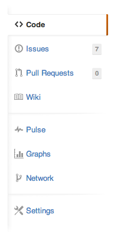
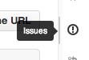
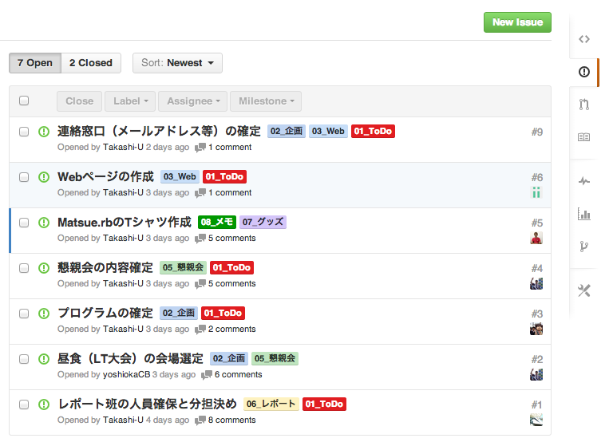

# 松江Ruby会議05

松江Ruby会議05(2013年3月15日・土曜日)の情報共有用です。

## ちょっとした説明

基本的にはWikiとIssuesぐらいしか利用しません。

* [Wiki](https://github.com/matsuerb/matrk05/wiki)
* [Issues](https://github.com/matsuerb/matrk05/issues)

ふつうのWikiや掲示板のような形で利用して、情報共有をしていきましょう。

### メニュー

このページの右側は、下図のようになっているでしょう。

WikiやIssuesの文字があるので分かりやすいです。

WikiやIssuesに進むと、下図のようになります。

アイコンだけになってわかりにくいですね。赤で囲ったのがIssuesで、ピンクで囲ったのがWikiになります。

迷ったら、アイコンの上にカーソルを合わせてみましょう。すると下図のようにポップアップしてリンク先を教えてくれます。

### Wiki

Markdown記法が利用出来ます。

慣れないうちは他の人が書いたものの修正にチャレンジしてみてはいかがでしょうか。また、修正箇所を見つけたり、追記事項に不備を発見したものの、修正方法やページの追加方法がよく分からなければ誰かに助けを求めましょう。

### Issues

掲示板のように利用すれば良いでしょう。コメントを書いて情報共有をしたり、コミュニケーションをとったりしましょう。

* Issueには「Open」の状態と「Closed」の状態があります。
* Openは作業中だったり未解決のもので、現在進行中の事案です。
* Closedは既に作業が完了したり、解決した課題です。
* 右上の緑色のボタン「New Issue」から新しくIssueを作成することが出来ます。
* IssueにもMarkdown記法が利用出来ます。（利用しなくてもOKです。）
* 各Issueにはラベルをつけることが出来ます。Issueの種別（ToDo、質問、メモ）やそれぞれの役割ごとにラベルを作成しています。（ラベルも必要に応じて追加・修正・削除してください。）

