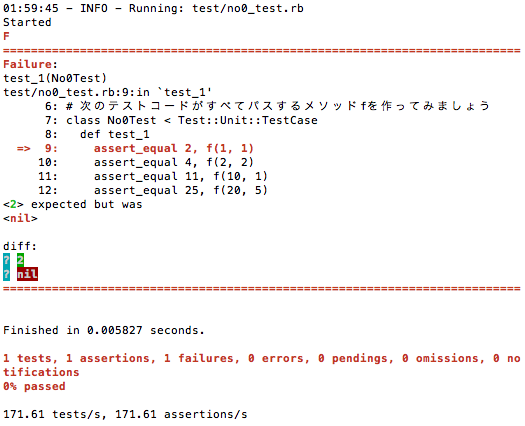
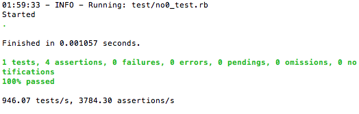

## 「takaokouji とrockzeroのぶつかり稽古」（ライブコーディング）

```
日時: 3/15(土) 16:50 〜 17:20
概要: takaokouji氏が出題したtestを満たすコードをrockzero君が回答していきます！
発表者:
 高尾 宏治 氏 （@takaokouji）
 岩石 嶺 君 （@rockzero）
```

## 準備

ターミナルで以下のコマンドを実行します。

```Shell
git clone https://github.com/matsuerb/matrk05.git
cd matrk05/live_coding_4
bundle
cd test
bundle exec guard start
```

## Let's Try

no0_test.rb をエディタで開きます。
そして、そこにあるメソッドfを修正して、テストコードをパスするようにします。

```Ruby
def f
    # <- ここを修正する
end
```

エディタで編集して保存するだけで、さきほど `bundle exec guard start` を実行したターミナルで自動的にテストが実行されます。

テストに失敗すると赤色でメッセージが表示されます。



成功すると緑色でメッセージが表示されます。



さぁ、no0_test.rb に挑戦してみてください。
